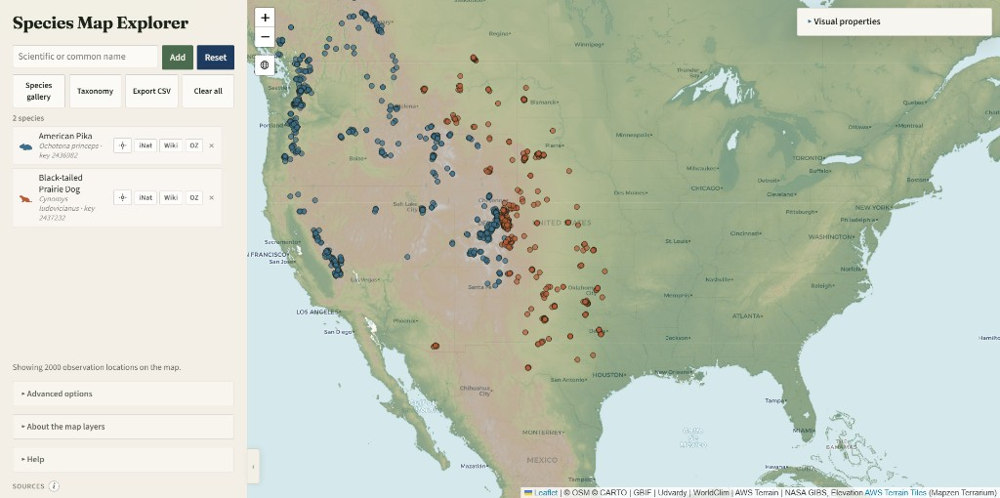

# Species Map Explorer [](https://doi.org/10.5281/zenodo.21681874)

Classroom web app for exploring species occurrence maps with open biodiversity data.

**Live demo:** [imageomics.github.io/hdr-species-map-explorer](https://imageomics.github.io/hdr-species-map-explorer/)

Students can add species by scientific or common name, sample GBIF occurrence points, toggle climate and elevation overlays, browse biogeographic provinces (Udvardy), and explore taxonomic context via iNaturalist, PhyloPic silhouettes, and related links.

<p align="center">
  
</p>

## Requirements

This is a static browser app — there is no Python package install or Node build step. See [`requirements.txt`](requirements.txt) for the machine-readable note.

- **To use the live demo:** a modern browser with JavaScript enabled and network access (the app calls GBIF, iNaturalist, and map/overlay tile services directly).
- **To run locally:** [Python](https://www.python.org/downloads/) 3.8+ is enough to serve `dashboard/` with the stdlib `http.server` (any other static file server also works). Leaflet and fonts are loaded from CDNs.

## Quick start

Serve the static app from `dashboard/` (any static file server works):

```bash
cd dashboard
python -m http.server 8765 --bind 127.0.0.1
```

Then open [http://127.0.0.1:8765/](http://127.0.0.1:8765/).

## Classroom use

The shared live demo is usually fine for a class: each browser session runs on its own, and map data is fetched directly from GBIF / iNaturalist / other providers (not through a shared app server).

If many students load large multi-species queries at once, provider rate limits or classroom bandwidth can slow things down. In that case, teachers can run a local copy:

1. Download this repository (**Code → Download ZIP**), or clone it with git.
2. Open a terminal in the unzipped folder.
3. Run the **Quick start** commands above (needs [Python](https://www.python.org/downloads/) installed).
4. Have students open `http://127.0.0.1:8765/` on that computer, or share that machine’s local network address if your school network allows it.

Forking the repo on GitHub and enabling GitHub Pages on your fork is another option if you want a class-specific hosted URL.

## Data sources

- [GBIF](https://www.gbif.org/) — occurrence points on the map (sample size and observation-type filters)
- [iNaturalist](https://www.inaturalist.org/) — example photos in the species gallery, plus taxonomy / similar-taxa tools (iNat observations are not plotted as their own map layer)
- [PhyloPic](https://www.phylopic.org/) — silhouettes (credit and licenses shown in-app)
- [OneZoom](https://www.onezoom.org/) — tree-of-life view opened from the species list (OZ button)
- [OpenStreetMap](https://www.openstreetmap.org/copyright) / [CARTO](https://carto.com/attribution/) — basemap tiles
- [WorldClim](https://www.worldclim.org/), [AWS Terrain](https://registry.opendata.aws/terrain-tiles/), [NASA GIBS](https://nasa-gibs.github.io/gibs-api-docs/) — climate / elevation / NDVI overlays
- [Udvardy biogeographic provinces (1975)](https://data-gis.unep-wcmc.org/server/rest/services/Bio-geographicalRegions/Udvardy_Biogeographical_Provinces_1975/FeatureServer) via UNEP-WCMC

**Possible overlap:** map points come only from GBIF, which often already includes many iNaturalist observations. Gallery images come from iNaturalist separately, so a photo in the gallery may be from an observation that also appears (or could appear) as a GBIF point on the map.

**Wikipedia:** the Wiki button on each species opens an English Wikipedia search for that name in a new tab. The app does not embed or query Wikipedia content otherwise.

Please respect each provider’s terms of use and attribution requirements when reusing outputs.

## Citation

If you use this software in research or teaching materials, please cite it via the DOI above (or GitHub’s **Cite this repository** button, which reads [`CITATION.cff`](CITATION.cff)). A BibTeX entry is also shown under **Sources** in the app.

## License

This project is released under the [MIT License](LICENSE).

## Contact

Caleb Charpentier · [calebcharpentier.com](https://calebcharpentier.com/) · [calebcharpentier00@gmail.com](mailto:calebcharpentier00@gmail.com)

## Acknowledgments

This work was supported by the NSF OAC 2118240 award: "HDR Institute: Imageomics: A New Frontier of Biological Information Powered by Knowledge-Guided Machine Learning." Any opinions, findings, and conclusions or recommendations expressed in this material are those of the author(s) and do not necessarily reflect the views of the National Science Foundation.
